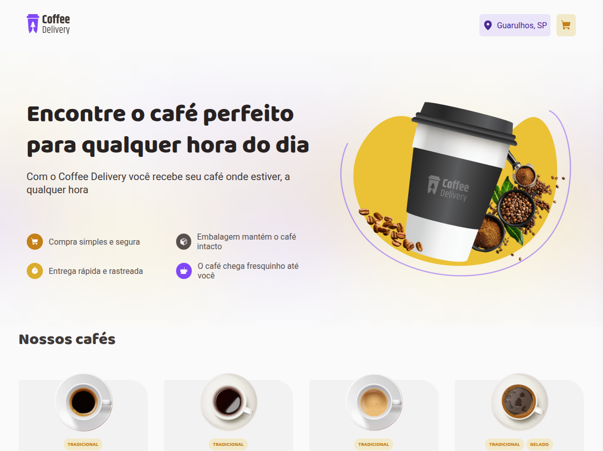

<h1 align="center">
Coffee Delivery
</h1>

  <a href="#-tecnologias">Tecnologias</a>&nbsp;&nbsp;&nbsp;|&nbsp;&nbsp;&nbsp;
  <a href="#-projeto">Projeto</a>&nbsp;&nbsp;&nbsp;|&nbsp;&nbsp;&nbsp;
  <a href="#-layout">Layout</a>&nbsp;&nbsp;&nbsp;|&nbsp;&nbsp;&nbsp;
  <a href="#memo-licenca">Licença</a>

  
  
  

  

## 🚀 Tecnologias

Esse projeto foi desenvolvido com as seguintes tecnologias:

- React
- TypeScript
- Vite
- Styled Components

## 💻 Projeto

O Coffee Delivery é uma aplicação de e-commerce fictícia para venda de cafés, onde o usuário pode selecionar cafés, adicionar ao carrinho, preencher o endereço de entrega e escolher o método de pagamento. Projeto desenvolvido como desafio do Ignite da Rocketseat.

## 🔖 Layout

O layout foi baseado no desafio do Ignite da Rocketseat. As imagens e design seguem o padrão proposto no desafio.

## :memo: Licença

Veja o arquivo [LICENSE](LICENSE) para mais detalhes.

### Autor

---

<a href="https://github.com/cleysonsilvame/" title="Cleyson Silva">
 
  

<b>Cleyson Silva</b> 🚀</a>

👋🏽 Entre em contato!

 
